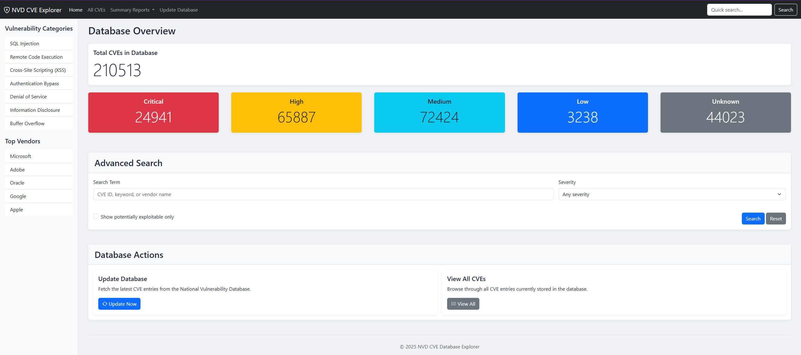

Collecting workspace information# NVD CVE Database API

## Overview
This project provides a Python-based interface for accessing and interacting with the National Vulnerability Database (NVD) CVE data. It aims to simplify security assessments by providing precise information about vulnerabilities, affected systems, and exploit proof of concepts.

## Purpose
Security professionals often need quick and reliable access to vulnerability data. This tool streamlines the process of:
- Retrieving detailed CVE information
- Identifying vulnerable systems
- Accessing exploit proof of concepts
- Supporting security engagements and penetration tests
- Facilitating surface-level security scanning

## Features
- Simple API for querying the NVD database
- Detailed vulnerability information retrieval
- Identification of affected systems and versions
- Links to available exploit POCs
- Filtering and search capabilities
- Export options for reports and integration

## Installation

```bash
# Clone the repository
git clone https://github.com/jensbecker-dev/nvd-db-api.git
cd nvd-db-api

# Install dependencies
pip install -r requirements.txt
```

## Usage

```python
from modules.nvdapi import NVDApi

# Initialize the API client
nvd = NVDApi()

# Search for a specific CVE
cve_details = nvd.get_cve("CVE-2021-44228")

# Search for vulnerabilities affecting a specific product
apache_vulns = nvd.search_by_product("apache", "log4j")

# Get exploitable vulnerabilities
exploitable = nvd.get_exploitable()
```

## Documentation
For detailed documentation, please refer to the [Wiki](https://github.com/yourusername/nvd-db-api/wiki).

## Contributing
Contributions are welcome! Please feel free to submit a Pull Request.

1. Fork the repository
2. Create your feature branch (`git checkout -b feature/amazing-feature`)
3. Commit your changes (`git commit -m 'Add some amazing feature'`)
4. Push to the branch (`git push origin feature/amazing-feature`)
5. Open a Pull Request

# #Screenshots

### Dashboard



## License
This project is licensed under the MIT License - see the LICENSE file for details.

## Acknowledgements
- [National Vulnerability Database](https://nvd.nist.gov/)
- [nvdlib](https://github.com/vehemont/nvdlib)

## Disclaimer
This tool is intended for legitimate security research and penetration testing with proper authorization. The authors are not responsible for any misuse or damage caused by this program.

Similar code found with 2 license types