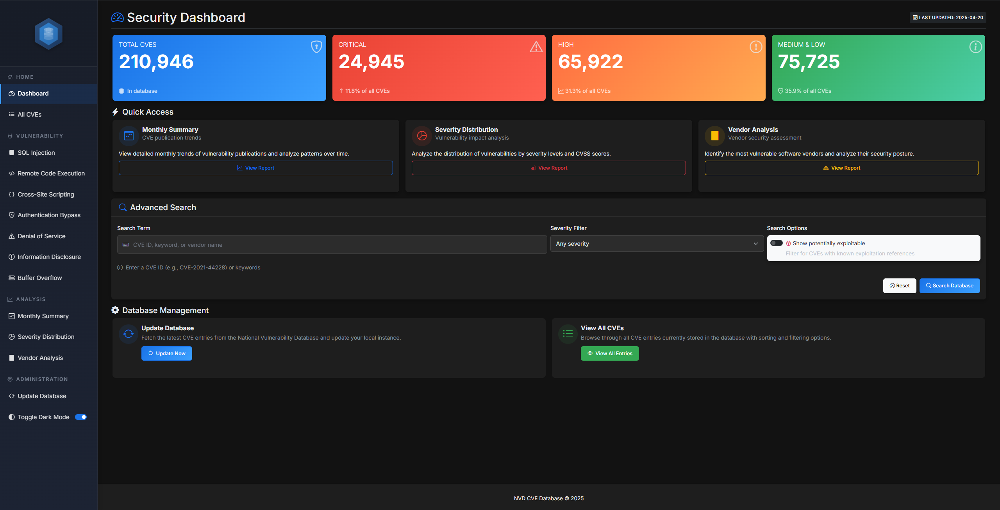

# NVD CVE Database API


## Overview
This application provides a comprehensive platform for analyzing and managing security vulnerabilities from the National Vulnerability Database (NVD). With a user-friendly web interface and powerful API endpoints, it supports security experts in assessing vulnerabilities and facilitates the identification of risks in digital environments.

## Purpose
In the constantly changing landscape of cybersecurity, professionals need reliable and up-to-date information about security vulnerabilities. This tool optimizes:
- Rapid identification of CVE details
- Analysis of affected systems and products
- Access to vulnerability information even without internet connection
- Visual representation of vulnerability trends and statistics
- Efficient assessment of vendors' security posture

## Main Features
- **Intuitive Search Interface**: Quick search for CVE IDs, vendors, products, or keywords
- **Comprehensive Data Visualization**: Graphical representation of severity distributions and temporal trends
- **Local Database**: SQLite database for offline access to CVE information
- **Automatic Updates**: Regular synchronization with official NVD feeds
- **Detailed Vulnerability Analysis**: Comprehensive information on vulnerabilities with CVSS ratings
- **Vendor-specific Analyses**: Deep insights into vulnerability patterns of specific vendors
- **REST API**: Programmatic access options for integrations with other tools
- **Category-based Filtering**: Focused search for specific vulnerability types
- **Monthly Summaries**: Overview of vulnerability trends over time

### Statistical Evaluations



## Installation

```bash
# Clone repository
git clone https://github.com/jensbecker-dev/nvd-db-api.git
cd nvd-db-api

# Install dependencies
pip install -r requirements.txt
```

## Usage

### Web Interface
Start the Flask application and access via browser:

```bash
python app.py
```

Then open your browser and navigate to `http://localhost:8080`

### API Access
The application provides RESTful API endpoints:

```
GET /api/cve/<cve_id> - Retrieve details about a specific CVE
GET /db_status - Check database status
```

### Programmatic Access
You can also use the NVDApi module directly in your Python code:

```python
from modules.nvdapi import NVDApi

# Initialize API client
nvd = NVDApi()

# Search for a specific CVE
cve_details = nvd.get_cve("CVE-2021-44228")

# Search for vulnerabilities for specific products
apache_vulns = nvd.search_by_product("apache", "log4j")
```

## Special Features


### Vendor Analyses
Detailed insights into the security situation of specific vendors:
- Top vendors by number of vulnerabilities
- Severity distribution per vendor
- Product-specific analyses
- Temporal development of vulnerabilities

### Category-based Views
Focused analyses of specific vulnerability types:
- SQL Injection
- Remote Code Execution
- Cross-Site Scripting
- Authentication Bypass
- Denial of Service
- Information Disclosure
- Buffer Overflow

### Monthly Overviews
Comprehensive time series analyses:
- Monthly distribution of new CVEs
- Severity development over time
- Identification of outliers and trends

## Dependencies
- Flask 2.3.3+
- SQLAlchemy 2.0.23+
- Requests 2.31.0+
- Python 3.8+

For complete list see `requirements.txt`

## License
This project is licensed under the MIT License - see the LICENSE file for details.

## Acknowledgements
- [National Vulnerability Database](https://nvd.nist.gov/)

## Disclaimer
This tool is intended for legitimate security research and penetration testing with appropriate authorization. The authors assume no responsibility for misuse or damage caused by this program.